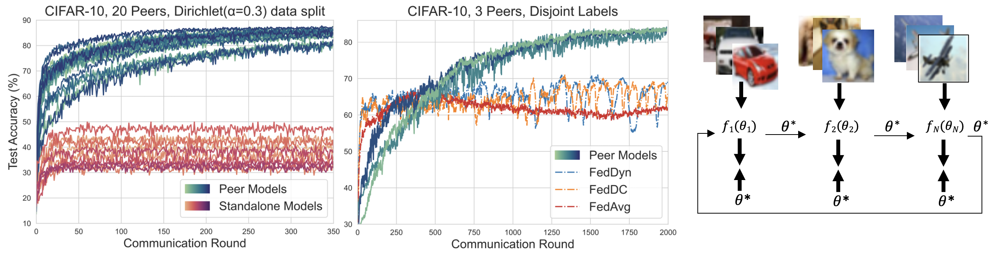

#### Cross-Silo Federated Learning across Divergent Domains with Iterative Parameter Alignment
Published at IEEE International Conference on Big Data

To get started, you can check out basic MNIST examples at: 
mnist_examples/mnist_mlp_2_.py and 
mnist_examples/mnist_mlp_2_detach.py